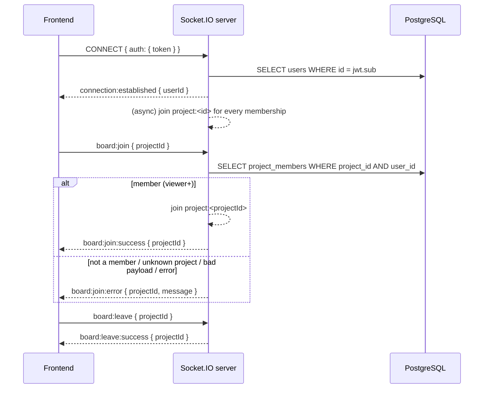

# Socket.IO contract — frontend integration

The real-time channel of the Kanban API. This file is the **source of truth for everything that
crosses the WebSocket**; HTTP endpoints are documented by Swagger (`/api/docs`). Written for the
frontend (Vite + React + TanStack Query); §7 is a reference implementation you can copy.

| | |
|---|---|
| Server | netty-socketio 2.0.14 → **Socket.IO protocol v4**. Use `socket.io-client` **^4**. |
| URL | `VITE_WS_URL`, default `http://localhost:1997` — a **separate port** from the HTTP API (`1996`). Default path `/socket.io`. |
| Auth | JWT access token in the Socket.IO `auth` payload: `io(url, { auth: { token } })`. |
| Casing | WS payloads are **camelCase** at the top level (`projectId`, `userId`, `createdAt`). The `payload` object inside `notification:new` reuses the HTTP **snake_case** shapes (`task_id`, …). |
| Transports | polling + websocket (client default) both work; `transports: ['websocket']` is fine too. |
| Socket ids | UUIDs, opaque to the client. |

**Changelog**

- 2026-09-12 (JAV-22): added `board:join` / `board:leave` and their replies; room broadcasts via
  `emitToProject` reserved (nothing emitted yet, see §5).

---

## 1. Connection & authentication

```ts
const socket = io(import.meta.env.VITE_WS_URL, {
  auth: (cb) => cb({ token: getAccessToken() }), // called on every (re)connect → always the current token
});
```

`token` is the `access_token` returned by `POST /api/auth/login` and `POST /api/auth/refresh`.
Do not rely on an `Authorization` header: browsers cannot set it on the WebSocket upgrade.

What the server does on connect:

1. Verifies the token (HS256, same `JWT_SECRET` as the HTTP API) and **reloads the user** — a
   deleted or deactivated account fails even with a syntactically valid token.
2. Success → joins the socket to `user:<userId>` and emits **`connection:established`** `{ userId }`.
   Shortly after (async) the presence module joins the socket to **every `project:<id>` room the
   user is a member of** and broadcasts `presence:update` to those rooms.
3. Failure → emits **`connection:error`** `{ message: "Authentication failed" }` and disconnects the
   socket ~50 ms later. Also happens when no `auth` payload arrives within **2 s** of the Engine.IO
   handshake.

Rules the client must follow:

- **On `connection:error`, call `socket.disconnect()`** before doing anything else. Otherwise
  socket.io-client's automatic reconnect turns a bad token into a reconnect loop. Then refresh the
  token (or send the user to login) and `socket.connect()` again.
- Token **expiry is only checked at connect and at `token:refresh`**; a socket is not dropped when
  its JWT expires mid-session. Still send `token:refresh` after every HTTP refresh (§2) so the
  socket is bound to a live token and a deactivated user is cut off.
- A **reconnect is a new session**: all rooms are lost. The presence auto-join re-runs by itself;
  **`board:join` must be re-sent** for every board that is still open (the hook in §7 does this on
  `connect`).

---

## 2. Message catalogue

### Client → server

| Event | Payload | Server reply | Notes |
|---|---|---|---|
| `token:refresh` | `{ token: string }` | `token:refresh:success` `{}` — or `token:refresh:error` `{ message: "Token refresh failed" }` followed by a disconnect | Send right after `POST /api/auth/refresh` succeeds. Re-validates the user and re-joins `user:<id>`. |
| `board:join` | `{ projectId: string }` | `board:join:success` `{ projectId }` — or `board:join:error` `{ projectId, message: "You do not have access to this project" }` | Membership (any role, viewer+) is checked **before** the socket joins `project:<projectId>`. The socket is **not** disconnected on error. See §5. |
| `board:leave` | `{ projectId: string }` | `board:leave:success` `{ projectId }` | No error reply. Missing, non-string or blank `projectId` → silently ignored. Leaving a room you are not in still succeeds. |

### Server → client

| Event | Delivered to | Payload | When |
|---|---|---|---|
| `connection:established` | the connecting socket | `{ userId: string }` | auth succeeded |
| `connection:error` | the connecting socket | `{ message: "Authentication failed" }` | auth failed; disconnect follows |
| `token:refresh:success` / `token:refresh:error` | the socket | `{}` / `{ message }` | reply to `token:refresh` |
| `board:join:success` / `board:join:error` / `board:leave:success` | the socket | see above | replies to `board:join` / `board:leave` |
| `notification:new` | room `user:<recipientId>` | §3 | a notification was created for this user |
| `presence:update` | rooms `project:<id>` of the affected user | §4 | a user went online / offline |
| *(reserved)* board broadcasts | room `project:<id>` | — | **nothing is emitted yet**; will be added and documented here |

All error messages are deliberately generic (see §6).

---

## 3. `notification:new`

Pushed to the recipient's `user:<id>` room at the moment a notification is created. **Never sent to
the actor themself.** The persisted notification (`GET /api/notifications`, snake_case, carries
`id` / `is_read`) is written by a separate async listener and is the source of truth — the WS event
has **no notification id**, so treat it as a *hint to refetch*, not as the record.

```ts
interface NotificationNew {
  type: 'comment_created' | 'comment_mentioned' | 'task_assigned' | 'task_updated' | 'project_invited';
  actorId: string;        // who caused it
  entityType: 'task' | 'comment' | 'project_invitation';
  entityId: string;       // id of that entity
  payload: NotificationPayload; // per-type, snake_case — below
  createdAt: string;      // ISO 8601, e.g. "2026-06-18T15:50:59.391Z"
}
```

| `type` | `entityType` / `entityId` | `payload` | Recipients |
|---|---|---|---|
| `comment_created` | `task` / task id | `{ task_id, task_title, ticket_id, comment_id, comment_preview, author: { id, full_name, avatar_url } }` | task subscribers |
| `comment_mentioned` | `comment` / comment id | `{ task_id, task_title, ticket_id, comment_id, comment_preview }` | users mentioned in the comment |
| `task_assigned` | `task` / task id | `{ task_id, task_title, ticket_id }` | newly assigned users |
| `task_updated` | `task` / task id | `{ task_id, task_title, ticket_id, changes: { status: { from, to } } }` | task subscribers — only emitted on a **status** change |
| `project_invited` | `project_invitation` / invitation id | `{ project_id, project_name, role, inviter: { id, full_name, avatar_url } }` | the invitee — only when they already have an account |

`ticket_id` is the human ticket key (e.g. `KAN-42`); `role` is a project role (`owner` \| `admin` \| `member` \| `viewer`).

**React Query:** on `notification:new`, `invalidateQueries({ queryKey: ['notifications'] })`
(covers the list and the unread count if both live under that key prefix). Use the `payload` only
for an optimistic toast.

---

## 4. `presence:update`

```ts
interface PresenceUpdate {
  userId: string;
  isOnline: boolean;
  connectionCount: number; // 0 when offline
  timestamp: string;       // ISO 8601
}
```

Broadcast to **every `project:<id>` room the user belongs to** when their **first** socket connects
(`isOnline: true`) and when their **last** socket disconnects (`isOnline: false, connectionCount: 0`).
Additional tabs of an already-online user emit nothing. You receive updates for a user only while
you share at least one project room with them.

Initial state comes from HTTP (both require the bearer token):

| Endpoint | Response |
|---|---|
| `GET /api/presence?userIds=<uuid>,<uuid>` (max 100) | `{ items: [{ userId, isOnline, connectionCount, lastChangedAt }] }` |
| `GET /api/presence/me` | `{ userId, isOnline, connectionCount, lastChangedAt }` |

`lastChangedAt` is `null` for a user who has not connected since the server started. Presence is
**in-memory**: a server restart resets everyone to offline.

---

## 5. Board rooms — `board:join` / `board:leave`

Purpose: subscribe a socket to a project's live board updates **only after the server has verified
membership**. Room name: `project:<projectId>`.

**When to send**

- `board:join { projectId }` when a board view mounts **and again on every `connect`** (reconnects
  lose rooms). Sending it twice is harmless (room membership is a set).
- `board:leave { projectId }` when the board view unmounts or the user navigates to another project.

**Authorization semantics**

- Any project member (`viewer` and up) is accepted → `board:join:success { projectId }`.
- Everything else → `board:join:error { projectId, message: "You do not have access to this project" }`:
  not a member, project does not exist, malformed payload (`projectId` missing / not a string /
  blank), socket without an authenticated user, or a server-side failure. **The client cannot and
  should not distinguish these cases** — this mirrors the HTTP API, where a non-member gets the same
  masked `404 Project with id "…" not found` as a missing project. Render the same "not found" state
  you use for the HTTP 404, and do **not** retry in a loop (a retry on the next `connect` is fine).
- `projectId` in the error is echoed back **only when you sent a non-blank string**; for a
  malformed payload it is `null` — the server never reflects other values back.
- A denied join does **not** disconnect the socket; other rooms and notifications keep working.

**Relationship to the presence auto-join**

On connect the server already joins the socket to every project room the user is a member of (§1),
so today `board:join` is strictly needed only for a project the user joined *after* connecting (an
invitation accepted mid-session). **Send it anyway**: it is the contract that upcoming board
broadcasts (task created / moved / updated, sent with `emitToProject`) will rely on, and it is the
explicit "may I watch this board?" signal. Right now the only event broadcast to project rooms is
`presence:update`.

**Known gap (server side):** a socket already in `project:<id>` is not evicted when the user is
removed from the project; it keeps receiving that room's broadcasts until it disconnects.



---

## 6. Error semantics (summary)

| Situation | What you get | What to do |
|---|---|---|
| Bad / expired token at connect, inactive user, no `auth` within 2 s | `connection:error` then disconnect | `socket.disconnect()`; refresh token or log out; `connect()` again with a fresh token |
| `token:refresh` with a bad token | `token:refresh:error` then disconnect | same as above |
| `board:join` refused for any reason | `board:join:error` (generic message), socket stays connected | show the not-found state for that project; retry only on the next `connect` |
| `board:leave` with a bad payload | nothing | — |
| Server restart | every socket disconnects; presence resets | let socket.io-client reconnect; re-send `board:join` on `connect` (hook below) |

Messages are intentionally uninformative: the WS channel must not reveal whether a project exists
or who is a member.

---

## 7. Reference implementation (Vite + React + TanStack Query v5)

Install: `npm i socket.io-client@^4`. Env: `VITE_WS_URL=http://localhost:1997`.

### `src/realtime/events.ts` — the typed contract

```ts
import type { Socket } from 'socket.io-client';

export type ProjectRole = 'owner' | 'admin' | 'member' | 'viewer';

export interface UserRef { id: string; full_name: string; avatar_url: string | null }

export type NotificationPayload =
  | { task_id: string; task_title: string; ticket_id: string; comment_id: string; comment_preview: string; author: UserRef } // comment_created
  | { task_id: string; task_title: string; ticket_id: string; comment_id: string; comment_preview: string }                  // comment_mentioned
  | { task_id: string; task_title: string; ticket_id: string }                                                                // task_assigned
  | { task_id: string; task_title: string; ticket_id: string; changes: { status: { from: string; to: string } } }            // task_updated
  | { project_id: string; project_name: string; role: ProjectRole; inviter: UserRef };                                        // project_invited

export interface NotificationNew {
  type: 'comment_created' | 'comment_mentioned' | 'task_assigned' | 'task_updated' | 'project_invited';
  actorId: string;
  entityType: 'task' | 'comment' | 'project_invitation';
  entityId: string;
  payload: NotificationPayload;
  createdAt: string;
}

export interface PresenceUpdate { userId: string; isOnline: boolean; connectionCount: number; timestamp: string }
export interface PresenceState { userId: string; isOnline: boolean; connectionCount: number; lastChangedAt: string | null }
export interface PresenceListResponse { items: PresenceState[] }

export interface ProjectRoomRef { projectId: string }
export interface ProjectRoomError { projectId: string | null; message: string }

export interface ServerToClientEvents {
  'connection:established': (p: { userId: string }) => void;
  'connection:error': (p: { message: string }) => void;
  'token:refresh:success': (p: Record<string, never>) => void;
  'token:refresh:error': (p: { message: string }) => void;
  'board:join:success': (p: ProjectRoomRef) => void;
  'board:join:error': (p: ProjectRoomError) => void;
  'board:leave:success': (p: ProjectRoomRef) => void;
  'notification:new': (p: NotificationNew) => void;
  'presence:update': (p: PresenceUpdate) => void;
}

export interface ClientToServerEvents {
  'token:refresh': (p: { token: string }) => void;
  'board:join': (p: ProjectRoomRef) => void;
  'board:leave': (p: ProjectRoomRef) => void;
}

export type AppSocket = Socket<ServerToClientEvents, ClientToServerEvents>;
```

### `src/realtime/socket.ts` — one socket per login session

```ts
import { io } from 'socket.io-client';
import type { AppSocket } from './events';

export function createSocket(getAccessToken: () => string | null): AppSocket {
  const socket: AppSocket = io(import.meta.env.VITE_WS_URL ?? 'http://localhost:1997', {
    autoConnect: false,
    auth: (cb) => cb({ token: getAccessToken() }), // fresh token on every (re)connect
  });
  // Stop the reconnect loop on an auth failure; the provider decides what happens next.
  socket.on('connection:error', () => socket.disconnect());
  socket.on('token:refresh:error', () => socket.disconnect());
  return socket;
}
```

### `src/realtime/SocketProvider.tsx` — lifecycle + React Query wiring

```tsx
import { createContext, useContext, useEffect, useState, type ReactNode } from 'react';
import { useQueryClient } from '@tanstack/react-query';
import { createSocket } from './socket';
import type { AppSocket, PresenceListResponse } from './events';
import { useAuth } from '../auth/useAuth'; // your auth store: { isAuthenticated, getAccessToken, onAuthError }

const SocketContext = createContext<AppSocket | null>(null);
export const useSocket = () => useContext(SocketContext);

export function SocketProvider({ children }: { children: ReactNode }) {
  const { isAuthenticated, getAccessToken, onAuthError } = useAuth();
  const queryClient = useQueryClient();
  const [socket, setSocket] = useState<AppSocket | null>(null);

  useEffect(() => {
    if (!isAuthenticated) return;
    const s = createSocket(getAccessToken);

    s.on('connection:error', onAuthError); // e.g. try a refresh, then s.connect() — or log out
    s.on('notification:new', () => {
      queryClient.invalidateQueries({ queryKey: ['notifications'] }); // list + unread-count
    });
    s.on('presence:update', (p) => {
      queryClient.setQueriesData<PresenceListResponse>({ queryKey: ['presence'] }, (old) =>
        old && {
          items: old.items.map((i) =>
            i.userId === p.userId
              ? { ...i, isOnline: p.isOnline, connectionCount: p.connectionCount, lastChangedAt: p.timestamp }
              : i,
          ),
        },
      );
    });

    s.connect();
    setSocket(s);
    return () => {
      s.disconnect();
      setSocket(null);
    };
  }, [isAuthenticated]); // one socket per login session — NOT per token refresh

  return <SocketContext.Provider value={socket}>{children}</SocketContext.Provider>;
}
```

After a successful `POST /api/auth/refresh` (body `{ refresh_token }`, response `{ access_token, refresh_token, user }`)
bind the socket to the new token:

```ts
socket?.emit('token:refresh', { token: access_token });
```

### `src/realtime/useBoardRoom.ts` — join on mount and on every reconnect, leave on unmount

```ts
import { useEffect, useState } from 'react';
import { useSocket } from './SocketProvider';

export type BoardRoomState = 'idle' | 'joining' | 'joined' | 'denied';

export function useBoardRoom(projectId: string | undefined): BoardRoomState {
  const socket = useSocket();
  const [state, setState] = useState<BoardRoomState>('idle');

  useEffect(() => {
    if (!socket || !projectId) return;
    const join = () => {
      setState('joining');
      socket.emit('board:join', { projectId });
    };
    const onSuccess = (p: { projectId: string }) => p.projectId === projectId && setState('joined');
    const onError = (p: { projectId: string | null }) => p.projectId === projectId && setState('denied');

    socket.on('board:join:success', onSuccess);
    socket.on('board:join:error', onError);
    socket.on('connect', join); // rooms are lost on reconnect → re-join
    if (socket.connected) join();

    return () => {
      socket.off('board:join:success', onSuccess);
      socket.off('board:join:error', onError);
      socket.off('connect', join);
      if (socket.connected) socket.emit('board:leave', { projectId });
      setState('idle');
    };
  }, [socket, projectId]);

  return state;
}
```

Usage in the board page:

```tsx
const room = useBoardRoom(projectId);
const board = useQuery({ queryKey: ['board', projectId], queryFn: () => api.getBoard(projectId), enabled: !!projectId });

if (room === 'denied' || board.error?.status === 404) return <NotFound />; // same state for both channels
```

When board broadcasts ship, the handler will be
`invalidateQueries({ queryKey: ['board', projectId] })` (or a targeted `setQueryData`) — nothing
else in this file changes.

### HTTP endpoints referenced here

| Endpoint | Purpose |
|---|---|
| `POST /api/auth/login`, `POST /api/auth/refresh` | `access_token` used as the socket `auth.token` |
| `GET /api/notifications`, `GET /api/notifications/unread-count` | refetched on `notification:new` |
| `GET /api/presence?userIds=…`, `GET /api/presence/me` | initial presence state, patched by `presence:update` |
| `GET /api/board/{projectId}` | the board a `board:join` subscribes to |

All of them require `Authorization: Bearer <access_token>`.
