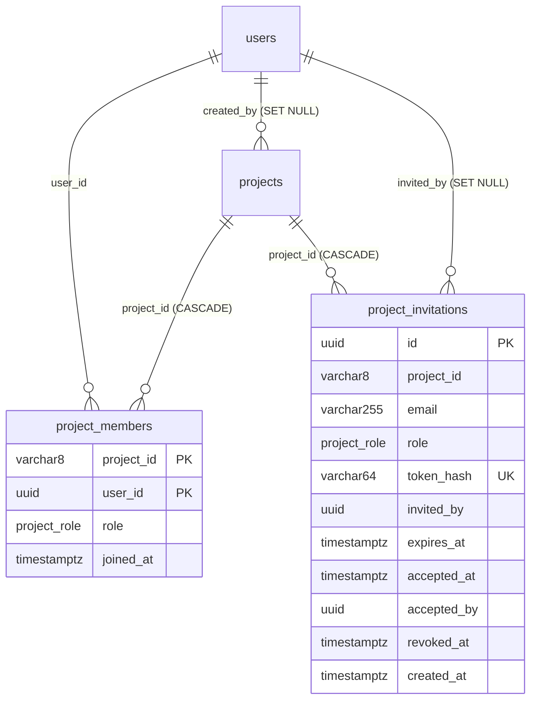

# Project Membership & RBAC

Server-enforced authorization for everything that belongs to a project: four project roles,
membership management with last-owner protection, hashed single-use invitations, one central
authorization gate used by every module, membership-scoped list queries, anti-enumeration 404s,
and membership-checked Socket.IO board rooms. Implemented across Linear tickets JAV-9 … JAV-22
(plan: `2026-08-22-project-membership-rbac.md`); documentation sweep JAV-23. This file is the
single source of truth for the feature; the per-module raw-SQL files under `docs/queries/` and the
frontend Socket.IO contract `docs/api-contracts/socket-events.md` are linked rather than repeated.

The code is Java 21 / Spring Boot 3.5. Comments and `MIGRATION.md` mention the NestJS service this
API was ported from; that origin is history only — every example below is the Java code.

---

## 1. Feature Overview

**Purpose.** Make the server — never the UI — decide who may see or change a project and its
boards, tasks, comments, teams and columns, based on the caller's membership in that project.

**Business requirements** (from the plan's source spec)

- Roles `owner > admin > member > viewer`; the creator of a project is its first owner.
- Invite people by email, remove members, change roles; no self-escalation; a project always keeps
  at least one owner.
- Permissions govern project editing, task creation/movement, member management and visibility.
- Invitations are single-use, expire, can be revoked, and are bound to the invited email.
- No cross-project enumeration: an outsider must not learn that a private project exists.
- The real-time channel obeys the same rules as HTTP.

**Problem it solved.** Before this work any authenticated user could read or mutate any project,
and several routes (labels, columns, team reads, user listing) were reachable without a token.

**Main use cases**

| Actor | Can |
|---|---|
| Any member (`viewer`+) | see the project, board, tasks, comments, activities, members, teams, columns; subscribe to tasks; join the board room |
| `member` | create / update / move / reorder / delete tasks and subtasks, manage assignees and labels on a task, comment |
| `admin` | update the project; add members; remove `member`/`viewer` members; create / list / revoke invitations for `member`/`viewer`; manage teams and columns |
| `owner` | delete the project; change roles that touch `owner`/`admin` (either direction); remove `owner`/`admin` members; invite as `admin` |
| anyone | leave a project they belong to (self-leave), subject to the last-owner rule |

**Assumptions.** Identity comes from the JWT (`JwtAuthInterceptor` reloads the live user on every
guarded request). `project_members` is the only source of authorization; `users.role`
(`UserRole`) is descriptive metadata and is never consulted. Project ids are the 8-character
`projects.id` values (`Param.Pipe.PROJECT_ID`).

**Non-goals (explicitly deferred).** Frontend work (`docs/api-contracts/socket-events.md` and
Linear JAV-32 cover the FE side of the real-time part); email delivery of invitations (no mailer:
the raw token is returned once and shared out of band); project-scoping labels (global table);
validating that task assignees are project members; scoping `GET /presence`; real-database tests;
evicting live sockets when a member is removed (see §14).

**Boundaries and packages**

| Package | RBAC pieces |
|---|---|
| `com.kanban.modules.project` | `ProjectAccessService` (the gate), `ProjectAccessQueries` / `JpaProjectAccessQueries`, `ProjectMember` + `ProjectMemberId`, `ProjectRole` + `ProjectRoleConverter`, `guards.RequireProjectRole` + `guards.ProjectRoleInterceptor`, membership methods of `ProjectService`, `ProjectController` |
| `com.kanban.modules.invitation` | `ProjectInvitation`, `ProjectInvitationRepository`, `InvitationService`, `InvitationController`, `dto.CreateInvitationDto`, `dto.AcceptInvitationDto` |
| `modules.team`, `modules.kanbancolumn`, `modules.task`, `modules.comment`, `modules.activity`, `modules.subscription`, `modules.board` | call sites of the gate (§3, §6) |
| `modules.user`, `modules.label` | JWT-only hardening; `GET /users/{id}/projects` is self-only |
| `modules.events`, `modules.presence` | `board:join` / `board:leave` rooms; auto-join to project rooms on connect |
| `modules.notification` | `PROJECT_INVITED` notification type (`NotificationListener`, `EventsService`) |
| `config.WebMvcConfig` | interceptor registration order |
| `src/main/resources/db/migration` | `V1` (`project_role`, `project_members`), `V2` (`project_invitations`), `V3` (`project_invited` enum value) |

---

## 2. Architecture

Two enforcement points share one policy object:

1. **Path-scoped routes** (the project id is in the URL — `/projects/{id}/…`,
   `/projects/{projectId}/teams/…`, `/board/{projectId}`) declare
   `@RequireProjectRole(value, param)`. `ProjectRoleInterceptor` runs **before the handler**,
   resolves the path variable, calls `ProjectAccessService.ensureRole` and stores the resulting
   membership on the request (`ProjectRoleInterceptor.MEMBERSHIP_ATTRIBUTE`, currently read by no
   handler).
2. **Entity-scoped routes** (only a task / column / comment id is in the URL) call the gate from
   the service (or, for subscriptions, the controller) as the **first statement**, because the
   project must be resolved from the entity in the database:
   `ensureTaskRole(taskId, …)` (task → column → project) and `ensureColumnRole(columnId, …)`.

Two rules bind both points: a caller with **no membership gets a 404 that is byte-identical to the
unknown-resource case** (project-, task- or column-flavored), and a member **below the required
role gets 403**. Never the other way round: a 403 for a non-member would confirm the resource
exists.

```mermaid
flowchart LR
  A[HTTP request] --> J[JwtAuthInterceptor<br/>verify JWT, reload User<br/>401 on failure]
  J --> R{@RequireProjectRole<br/>on handler/class?}
  R -- yes --> G[ProjectRoleInterceptor<br/>path var → ensureRole<br/>404 masked / 403]
  R -- no --> H[Controller handler]
  G --> H
  H --> S[Service]
  S --> T{entity-scoped?}
  T -- task/column id --> E[ensureTaskRole / ensureColumnRole<br/>native project lookup + membership PK]
  T -- project id --> F[ensureRole]
  E --> Q[repositories]
  F --> Q
```

**Dependency injection.** `ProjectAccessService(ProjectMemberRepository, ProjectAccessQueries)`
depends only on the data layer, so every module can inject it without cycles: `ProjectService`,
`InvitationService`, `TeamService`, `KanbanColumnService`, `TaskService`, `CommentService`,
`ActivityService`, `SubscriptionController`, `EventsGateway`, `ProjectRoleInterceptor`.
`InvitationService` additionally depends on `ProjectService` (project lookups), `UserRepository`,
`ProjectMemberRepository` and `EventBus`.

**Spring MVC lifecycle points that matter here**

- Interceptors run **before argument resolution**, so on a guarded route a missing token yields
  `401` even when a path parameter is malformed (the `ParamResolver`'s `400 Validation failed
  (uuid is expected)` only appears for authenticated callers). `WebMvcConfig.addInterceptors`
  registers `JwtAuthInterceptor` first and `ProjectRoleInterceptor` second; the second one throws
  `UnauthorizedException` if it ever runs without an attached user.
- `ProjectRoleInterceptor` reads the path variable from
  `HandlerMapping.URI_TEMPLATE_VARIABLES_ATTRIBUTE`; the annotation's `param` defaults to
  `"projectId"` and is `"id"` on `ProjectController`. A method-level annotation overrides a
  class-level one (`BoardController` is class-level `@JwtAuth`, method-level role).
- Exceptions thrown from `preHandle` reach the same `GlobalExceptionHandler`
  (`@RestControllerAdvice`) as controller exceptions, so bodies are identical.
- `@Transactional` on `ProjectService.removeMembers`, `ProjectService.changeMemberRole` and
  `InvitationService.accept` is proxy-based: it only applies when called through the Spring bean
  (a private helper calling them from inside the same class would bypass it).

**Synchronous vs asynchronous.** Every authorization decision is synchronous and inside the
request. Only the side effects of an invitation are asynchronous: `ProjectInvitedEvent` is
published through `EventBus` and handled on the `eventExecutor` pool by `NotificationListener`
(DB row) and `EventsService` (Socket.IO push).

**Design decisions and trade-offs**

| Decision | Why | Trade-off |
|---|---|---|
| Non-member → 404, insufficient role → 403 | anti-enumeration: private projects must not be discoverable by probing ids | clients cannot tell "no access" from "does not exist"; support tooling must look at the DB |
| Interceptor for path-scoped routes, service call for entity-scoped ones | resolving task → project needs a query; services do that idiomatically here | two call styles to keep in sync (§15) |
| `ensureTaskRole` / `ensureColumnRole` re-implement the membership check instead of delegating to `ensureRole` | the 404 must carry the task/column message, never the project one | ~10 duplicated lines in `ProjectAccessService` |
| `SELECT … FOR UPDATE` on the project row before membership mutations | the "at least one owner" count must not go stale between read and write | membership changes on one project serialize |
| Invitation token stored only as SHA-256 hex; raw token returned once | a leaked DB dump cannot be used to join projects | no way to re-display a token; re-invite instead |
| Invitation acceptance bound to the invited email and every failure → the same generic `400` | a leaked link is useless to others; the endpoint is not an oracle | genuinely expired invitations are indistinguishable from typos for the user |
| Owner is never grantable by invitation; role changes touching `owner`/`admin` are owner-only | prevents admins from escalating themselves or friends | owners must act to promote |
| Self role change forbidden, self-leave allowed at any role | no self-escalation, but anyone may walk away | last owner cannot leave without promoting someone first (`409`) |
| `users.role` ignored for authorization | it is a job title, not a permission | none |

---

## 3. API Design

All routes below are under the global `/api` prefix and, unless stated otherwise, require
`Authorization: Bearer <access_token>` (`@JwtAuth` + `@SecurityRequirement(name = "bearer")`).
Bodies and DTO fields are snake_case. Error bodies are the Nest-compatible shapes described in
§10. "Gate" names where the role check happens and the minimum role.

### 3.1 Membership endpoints (`ProjectController`)

| Method & route | Handler | Gate | Success | Errors |
|---|---|---|---|---|
| `POST /api/projects` | `create` | JWT only; creator becomes `owner` | `201` project | `400` validation, `409` name exists |
| `GET /api/projects` | `findAll` | JWT; **scoped** to the caller's memberships | `200` `[project…]` | — |
| `GET /api/projects/{id}` | `findOne` | interceptor `viewer` | `200` project | `404` masked |
| `PATCH /api/projects/{id}` | `update` | interceptor `admin` | `200` project | `403`, `404` masked, `409` |
| `DELETE /api/projects/{id}` | `remove` | interceptor `owner` | `200` (legacy, no body) | `403`, `404` masked, `409` has columns |
| `GET /api/projects/{id}/members` | `getMembers` | interceptor `viewer` | `200` `ApiListResponse` of memberships with `user` | `404` masked |
| `POST /api/projects/{id}/members` | `addMembers` | service `admin` | `201` (no body) | `400`, `403`, `404` masked / `Users not found: …` |
| `DELETE /api/projects/{id}/members` | `removeMembers` | service `viewer` base; `admin` to remove others; `owner` when a target is `owner`/`admin`; self-leave at any role | `204` | `400`, `403`, `404` masked, `409` last owner |
| `PATCH /api/projects/{id}/members/{userId}` | `changeMemberRole` | service `admin` base; `owner` when the current **or** new role is `owner`/`admin` | `200` membership with `user` | `400`, `403` (incl. self-change), `404` masked / `User is not a member of this project`, `409` last owner |

Path params: `{id}` → `@Param(pipe = Param.Pipe.PROJECT_ID)`, `{userId}` → `Pipe.UUID`.

Request DTOs (`ValidatedDto` subclasses, validated by `@ValidatedBody`):

| DTO | Fields | Rules |
|---|---|---|
| `ManageProjectMembersDto` | `user_ids: List<String>` | `@IsArray @ArrayNotEmpty @IsUUID(version = "4", each = true)` |
| `UpdateMemberRoleDto` | `role: ProjectRole` | `@IsEnum(ProjectRole.class)` — `owner`, `admin`, `member`, `viewer` |

```java
@PatchMapping("/{id}/members/{userId}")
@JwtAuth
@SecurityRequirement(name = "bearer")
@Operation(summary = "Change a member's role (admin+; owner for owner/admin changes)")
public Map<String, Object> changeMemberRole(@Param(value = "id", pipe = Param.Pipe.PROJECT_ID) String id,
    @Param(value = "userId", pipe = Param.Pipe.UUID) String userId,
    @ValidatedBody UpdateMemberRoleDto dto, @CurrentUser("id") String actorId) {
  return projectService.changeMemberRole(id, userId, dto.role, actorId).toJsonWithUser();
}
```

Example — promote a member (owner calling):

```http
PATCH /api/projects/UrzWUH3e/members/22222222-2222-4222-8222-222222222222
Authorization: Bearer <token>
Content-Type: application/json

{ "role": "admin" }
```

```json
{
  "project_id": "UrzWUH3e",
  "user_id": "22222222-2222-4222-8222-222222222222",
  "role": "admin",
  "user": { "id": "22222222-…", "email": "jane@example.com", "full_name": "Jane", "role": "backend_developer", "avatar_url": "…", "is_active": true, "created_at": "…", "updated_at": "…" },
  "joined_at": "2026-09-01T10:00:00.000Z"
}
```

Membership JSON never includes `password_hash` (`User.toJson()` omits it).

### 3.2 Invitation endpoints (`InvitationController`)

| Method & route | Handler | Gate | Success | Errors |
|---|---|---|---|---|
| `POST /api/projects/{projectId}/invitations` | `create` | service `admin`; `owner` when `role = admin` | `201` invitation **+ one-time `token`** | `400` validation, `403`, `404` masked, `409` already member / already invited |
| `GET /api/projects/{projectId}/invitations` | `findPending` | service `admin` | `200` `ApiListResponse` of pending invitations with `inviter` | `403`, `404` masked |
| `DELETE /api/projects/{projectId}/invitations/{invitationId}` | `revoke` | service `admin` | `204` (idempotent for already-revoked) | `403`, `404` masked / `Invitation not found`, `409` already accepted |
| `POST /api/invitations/accept` | `accept` | JWT; **the token is the credential**, plus the caller's email must equal the invited email | `200` project (with `creator`) | `400` `Invalid or expired invitation` (all invalid cases), `409` already a member |

| DTO | Fields | Rules |
|---|---|---|
| `CreateInvitationDto` | `email: String`, `role: ProjectRole?` | `@IsEmail`; `@IsOptional @IsIn({"admin","member","viewer"})` — default `member`; `owner` is rejected at validation |
| `AcceptInvitationDto` | `token: String` | `@IsString @MinLength(64) @MaxLength(64)` |

Example — invite:

```http
POST /api/projects/UrzWUH3e/invitations
{ "email": "Jane@Example.com", "role": "viewer" }
```

```json
{
  "id": "5d2c…", "project_id": "UrzWUH3e", "email": "jane@example.com", "role": "viewer",
  "expires_at": "2026-09-19T10:00:00.000Z", "accepted_at": null, "revoked_at": null,
  "created_at": "2026-09-12T10:00:00.000Z",
  "token": "3f1a…64 hex characters…"
}
```

The email is trimmed and lower-cased before storage and comparison. `token` appears **only** in
this response; `GET …/invitations` returns the same object with `inviter` embedded and no token or
hash.

### 3.3 Existing endpoints that gained a gate

| Module / route | Minimum role and where it is enforced |
|---|---|
| `GET /api/board/{projectId}` | `viewer` — interceptor (`BoardController`) |
| `GET /api/projects/{projectId}/teams`, `…/teams/{teamId}`, `…/teams/{teamId}/members` | `viewer` — interceptor (`TeamController`) |
| `POST …/teams`, `POST …/teams/{teamId}/members`, `DELETE …/teams/{teamId}/members/{userId}` | `admin` — `TeamService.ensureRole` |
| `POST /api/columns` | `admin` on `dto.project_id` — `KanbanColumnService.create` |
| `GET /api/columns` | scoped to the caller's projects (`getProjectIdsForUser`); empty list without a query when they have none |
| `GET /api/columns/{id}` | `viewer` — `ensureColumnRole` (column-flavored 404) |
| `PATCH /api/columns/{id}` | `admin` — `ensureColumnRole`; **also `admin` on the target project** when `project_id` moves the column |
| `DELETE /api/columns/{id}` | `admin` — `ensureColumnRole` |
| `POST /api/tasks` | `member` on the column's project — `ensureRole` |
| `GET /api/tasks` | scoped to the caller's projects |
| `GET /api/tasks/{id}`, `GET /api/tasks/by-ticket/{ticketId}`, `GET /api/tasks/{id}/subtasks` | `viewer` — `ensureTaskRole` (task-flavored 404) |
| `PATCH /api/tasks/{id}`, `DELETE /api/tasks/{id}`, `PATCH …/reorder`, `POST/DELETE …/assignees`, `POST/DELETE …/labels`, `POST …/subtasks`, `PATCH …/subtasks/{subtaskId}/reorder` | `member` — `ensureTaskRole` |
| `PATCH /api/tasks/{id}/move` | `member` on the source task **and** on the target column's project when it differs |
| `POST /api/tasks/{taskId}/comments` | `member` — `CommentService.create` |
| `GET /api/tasks/{taskId}/comments` | `viewer` — `CommentService.findByTask` |
| `GET /api/tasks/{taskId}/activities` | `viewer` — `ActivityService.findByTask` |
| `POST/DELETE /api/tasks/{taskId}/subscription`, `GET …/subscription/me`, `GET …/subscribers` | `viewer` — `SubscriptionController` |
| `GET /api/users`, `GET /api/users/{id}` | JWT only (any authenticated user; accepted exposure — powers invite/mention pickers) |
| `GET /api/users/{id}/projects` | self only — `UserService.findProjects` → `403 You can only view your own projects` |
| `GET /api/users/me/projects` | JWT; the caller's own list |
| `/api/labels/*` (all five) | JWT only — labels are a global table |

`PATCH /api/comments/{id}` and `DELETE /api/comments/{id}` keep their pre-existing **ownership**
check (`authorId.equals(userId)`); they are not part of the role gate.

### 3.4 Error responses

| Case | Status | Body |
|---|---|---|
| no / invalid / expired token, inactive user | `401` | `{ "message": "Unauthorized", "statusCode": 401 }` |
| body fails validation | `400` | `{ "message": ["role must be one of the following values: owner, admin, member, viewer"], "error": "Bad Request", "statusCode": 400 }` |
| not a member (or project missing) | `404` | `{ "statusCode": 404, "message": "Project with id \"UrzWUH3e\" not found" }` — or `Task with id "…" not found` / `Column with id "5" not found` on entity-scoped routes |
| member below the role | `403` | `{ "statusCode": 403, "message": "This action requires at least admin role" }` |
| own role change | `403` | `{ "statusCode": 403, "message": "You cannot change your own role" }` |
| target not a member | `404` | `{ "statusCode": 404, "message": "User is not a member of this project" }` |
| last owner would leave / be demoted | `409` | `{ "statusCode": 409, "message": "A project must have at least one owner" }` |
| invitee already a member / pending invite exists | `409` | `…"User is already a member of this project"` / `…"A pending invitation already exists for this email"` |
| bad, expired, revoked, used or wrong-email token | `400` | `{ "statusCode": 400, "message": "Invalid or expired invitation" }` |
| accepting user already a member | `409` | `{ "statusCode": 409, "message": "You are already a member of this project" }` |
| interceptor cannot find the path variable | `404` | `{ "statusCode": 404, "message": "Project not found" }` |

---

## 4. Database Design

Three tables carry the feature; `users` and `notifications` are referenced. Source of truth:
`V1__baseline_schema.sql` (`project_role`, `projects`, `project_members`),
`V2__create_project_invitations.sql`, `V3__add_project_invited_notification_type.sql`.



| Table | Entity | Notes |
|---|---|---|
| `project_members` | `ProjectMember` (`@IdClass(ProjectMemberId.class)`) | composite PK `(project_id, user_id)` = "one membership per user per project"; both FKs `ON DELETE CASCADE` (deleting a project or a user removes memberships); `role project_role NOT NULL DEFAULT 'member'`; `joined_at` DB default, mapped with `@CreationTimestamp(source = DB)`; lazy `user` and `project` relations (`insertable = false, updatable = false`); index `idx_project_members_user_id` |
| `project_invitations` | `ProjectInvitation` (app-generated UUID id) | `project_id → projects ON DELETE CASCADE`; `invited_by → users ON DELETE SET NULL` (inviter deletion keeps the invitation); `token_hash VARCHAR(64)` with **unique** `idx_project_invitations_token_hash`; `idx_project_invitations_project_id`, `idx_project_invitations_email`; lifecycle is encoded in three nullable timestamps — `accepted_at`/`accepted_by`, `revoked_at`, and `expires_at` — there is no status column |
| `project_role` (enum) | `ProjectRole` (`WireEnum`, `@JsonValue value()`, `rank()`) + `ProjectRoleConverter` (`@Converter`) | `'owner','admin','member','viewer'`; the JDBC URL's `stringtype=unspecified` lets PostgreSQL cast the bound string to the enum |
| `notifications_type_enum` | `NotificationType.PROJECT_INVITED` | `V3` adds `'project_invited'` with `ALTER TYPE … ADD VALUE IF NOT EXISTS` |
| `projects.created_by` | `Project.creator` (lazy) | informational; authorization never reads it |

Why this shape: the composite PK gives uniqueness for free and makes the gate a single PK lookup;
the role lives in the row (not on the user) so one person can be owner here and viewer there;
invitations store a hash so the DB never contains a usable credential; deriving "pending" from
timestamps keeps accept/revoke to single conditional statements (§6) at the cost of a small
predicate repeated in each pending query.

Java ↔ SQL: `ProjectMember.projectId` → `project_id VARCHAR(8)`, `userId` → `user_id UUID`
(`columnDefinition = "uuid"`), `role` → `project_role` via the converter; repository methods in §5.

---

## 5. Repository and Persistence Layer

`open-in-view` is off and every relation is `FetchType.LAZY`, so any relation a response needs
is loaded by the query that fetches the row (`@EntityGraph`); mutations follow save-then-refetch.
The SQL for every method below is written out once in §12 (numbers in brackets).

**`ProjectMemberRepository`** (`JpaRepository<ProjectMember, ProjectMemberId>`)

| Method | Kind | Used for |
|---|---|---|
| `findByProjectIdAndUserId` [Q1] | derived PK lookup | the gate (`getMembership` / `ensureRole` / `ensureTaskRole` / `ensureColumnRole`), target lookup in `changeMemberRole` |
| `existsByProjectIdAndUserId` | derived | `TeamService.addMember` (target must be a project member) |
| `findProjectIdsByUserId` [Q2] | JPQL projection | scoping `GET /tasks`, `GET /columns`, presence auto-join |
| `findByProjectIdWithUserOrderByJoinedAtAsc` [Q9] | JPQL + `@EntityGraph("user")` | `GET /projects/{id}/members` |
| `findByUserIdWithProjectOrderByJoinedAtDesc` [Q10] | JPQL + `@EntityGraph({"project","project.creator"})` | `GET /projects`, `GET /users/me/projects`, `GET /users/{id}/projects` |
| `findByProjectIdAndUserIdIn` [Q6] | derived | existing / target memberships in `addMembers`, `removeMembers` |
| `findByProjectIdAndUserIdWithUser` [Q9 single-row] | JPQL + `@EntityGraph("user")` | response of `changeMemberRole` |
| `countByProjectIdAndRole` [Q5] | derived count | last-owner guard |
| `save` / `saveAll` + `flush` / `saveAndFlush` [Q7] | CRUD | creator membership, `addMembers`, `accept` |
| `save` on a loaded row [Q8] | CRUD → UPDATE | `changeMemberRole` |
| `deleteByProjectIdAndUserIdIn` [Q11] | JPQL `@Modifying` (own `@Transactional`) | `removeMembers` |

`ProjectMember` has an **assigned** composite id and no `@Version`, so Spring Data treats every
instance as *not new* and calls `em.merge`: each insert or update is preceded by the Q1 SELECT.

**`ProjectRepository`**: `findByIdForUpdate` [Q4] — JPQL with `@Lock(PESSIMISTIC_WRITE)`, first
statement of `removeMembers` / `changeMemberRole`; `findByIdWithCreator` — `@EntityGraph("creator")`
for every project response; `existsById` — legacy existence pre-check in `getMembers` / `addMembers`.

**`ProjectInvitationRepository`** (`JpaRepository<ProjectInvitation, String>`)

| Method | Kind | Used for |
|---|---|---|
| `findByTokenHash` [Q12] | derived, unique index | `accept` |
| `findPendingByProjectIdAndEmail` [Q13] | JPQL with the pending predicate | duplicate guard in `create` |
| `findPendingByProjectId` [Q15] | JPQL + `@EntityGraph("inviter")` | `findPending` |
| `revokePending` [Q16] | JPQL `@Modifying` conditional UPDATE (own `@Transactional`), returns rows affected | `revoke` |
| `findByIdAndProjectId` | derived | `revoke`, only when Q16 touched no row |
| `saveAndFlush` (new) [Q14] / `save` (managed) [Q17] | CRUD | `create` / `accept` |

**`JpaProjectAccessQueries`** — `EntityManager.createNativeQuery`: `findProjectIdForTask` [Q3a]
and `findProjectIdForColumn` [Q3b]. Native because Spring Data cannot express the task → column
→ project join as a projection cleanly; `CAST(:taskId AS uuid)` keeps the parameter typed.

Flush behaviour: `saveAndFlush` where the unique-violation must surface inside the `try` that maps
it to `409` (project create, invitation create); plain `save` inside `@Transactional` methods where
the commit flushes (`accept`, `changeMemberRole`).

---

## 6. Service Logic

### 6.1 `ProjectAccessService` — the gate

| Method | Behaviour |
|---|---|
| `getMembership(projectId, userId)` | Q1; `null` when absent — used where absence is a valid state (invitation checks) |
| `ensureRole(projectId, userId, min)` | Q1; no row → `404 Project with id "…" not found`; `rank() < min.rank()` → `403 This action requires at least <min> role`; returns the membership |
| `ensureTaskRole(taskId, userId, min)` | Q3a → unknown task **or** non-member → `404 Task with id "…" not found`; then the same 403 rule; returns the project id |
| `ensureColumnRole(columnId, userId, min)` | Q3b, column-flavored 404, same 403 rule |
| `getProjectIdsForUser(userId)` | Q2; the scoping list for `GET /tasks`, `GET /columns` and presence |

Role comparison uses `ProjectRole.rank()` (`OWNER 3 > ADMIN 2 > MEMBER 1 > VIEWER 0`), never
enum order or string comparison.

### 6.2 Membership management (`ProjectService`)

**`create(dto, actorId)`** — generates the tag, then inside a `TransactionTemplate`: insert the
project and the creator's `OWNER` membership (Q7). Retries up to 3 times on project-id or tag
unique collisions (regenerating the tag); a name collision → `409`. Returns the re-fetched project.

**`findAll(userId)`** — Q10; only the caller's projects.

**`addMembers(projectId, userIds, actorId)`** — `existsById` → `ensureRole(admin)` → all users
must exist (`404 Users not found: …`) → Q6 to skip existing members (idempotent) → `saveAll` +
`flush` new rows as `member` (Q7 ×N). No transaction annotation: the batch is one flush, and a
failure mid-way leaves earlier rows (see §14).

**`removeMembers(projectId, userIds, actorId)`** — `@Transactional`:
1. `findByIdForUpdate` (Q4) — locks the project row; missing project → the masked 404.
2. `ensureRole(viewer)` — any member may reach the method.
3. Self-leave = exactly one id equal to the actor: skips the role rules.
4. Otherwise the required role is `owner` if any target is `owner`/`admin`, else `admin`.
5. If any target is an owner: `countByProjectIdAndRole(owner)` (Q5) minus leaving owners must stay ≥ 1, else `409`.
6. `TeamMemberRepository.deleteByProjectIdAndUserIdIn` then `deleteByProjectIdAndUserIdIn` (Q11): leaving a project also leaves its teams.

**`changeMemberRole(projectId, targetUserId, newRole, actorId)`** — `@Transactional`:
1. lock (Q4) → `ensureRole(admin)`.
2. `actorId.equals(targetUserId)` → `403 You cannot change your own role`.
3. target membership (Q1) missing → `404 User is not a member of this project`.
4. `owner` required if the **current or new** role is `owner`/`admin`.
5. demoting an owner → last-owner check (Q5).
6. `save` only when the role changes (Q8); re-read with `user` for the response.

**Concurrency.** Both mutating methods hold the project row lock until commit, so two owners
demoting each other, or two owners self-leaving, execute one after the other and the second one
sees the updated owner count. `addMembers` and `create` are not serialized against them; the
composite PK makes a duplicate insert fail loudly rather than corrupt data.

**Rollback.** Inside `@Transactional` / `TransactionTemplate`, any `RuntimeException` (all
`HttpException`s included) rolls the statements back; the caller receives the mapped status.

### 6.3 Invitations (`InvitationService`)

**`create(projectId, dto, actorId)`**: role defaults to `member`; gate `owner` when inviting an
`admin`, otherwise `admin`; normalize the email; if the email has an account **and** is already a
member → `409`; a pending invitation for the email → `409` (Q13); generate 32 random bytes
(`SecureRandom`) → 64-hex token; store `sha256(token)`, `expires_at = now + 7 days`
(`INVITATION_TTL`); if the invitee has an account, emit `ProjectInvitedEvent` (§7); return
`toJson(false)` plus the raw `token`.

**`findPending(projectId, actorId)`**: gate `admin`, then Q15 (newest first, inviter embedded).

**`revoke(projectId, invitationId, actorId)`**: gate `admin`, then one conditional UPDATE (Q16).
1 row → `204`. 0 rows → read the row: missing → `404 Invitation not found`; accepted → `409`;
already revoked → `204` (idempotent). A concurrent accept cannot slip between a read and the
write because the pending predicate is in the statement.

**`accept(token, user)`** — `@Transactional`: Q12 by hash; **any** of unknown / revoked / accepted
/ expired / email ≠ caller's email → the same `400 Invalid or expired invitation`; already a
member → `409`; otherwise insert the membership with the invitation's role (Q7), set
`accepted_at`/`accepted_by` (Q17), return the project. Single-use is enforced by `accepted_at`;
two concurrent accepts of one token are stopped by the composite PK of `project_members`, the
loser rolling back.

### 6.4 Gates in the other modules

Ordering rule everywhere: **gate first, then look the entity up**, so a non-member cannot learn
whether a team/task/column exists. `TeamService.create` and `ProjectService.addMembers` still run
an `existsById` before the gate; both messages are identical to the masked 404, so no information
leaks. `KanbanColumnService.update` and `TaskService.move` gate **twice** when the target project
differs from the current one (an admin/member of project A cannot push a column or task into
project B without also being admin/member there). `TaskService.findAllForUser` and
`KanbanColumnService.findAll` return `[]` without a query when the caller has no memberships.

---

## 7. Event and Real-Time Flow

**Application event: `ProjectInvitedEvent`** (`com.kanban.modules.notification.events`, a record
implementing `BaseNotificationEvent`): `actor_id` = inviter, `entity_type` = `project_invitation`,
`entity_id` = invitation id, `recipient_ids` = `[inviteeUserId]`, `payload` =
`{ project_id, project_name, role, inviter: { id, full_name, avatar_url } }`. Emitted by
`InvitationService.create` only when the invited email already belongs to a user.

```text
InvitationService.create
  → EventBus.emit(new ProjectInvitedEvent(...))
  → SpringEventBus → ApplicationEventPublisher.publishEvent(event)
  → NotificationListener.handleProjectInvited   (@Async("eventExecutor") @EventListener)
        → NotificationService.createBatch → INSERT INTO notifications (type = 'project_invited', payload JSONB)
  → EventsService.handleProjectInvited          (@Async("eventExecutor") @EventListener)
        → EventsGateway.emitToUser(inviteeId, "notification:new", { type, actorId, entityType, entityId, payload, createdAt })
```

Spring dispatches by the **Java type** of the event object — there is no string event name; the
`"project.invited"` literal in the listener is only a log label. Both listeners catch and log
their own `RuntimeException`s; a failure there never reaches the HTTP response. Ordering between
the two listeners is not guaranteed, and both run **after** `create` has already committed the
invitation, so a crash between the commit and the listeners loses only the notification.

**Socket.IO board rooms** (`EventsGateway`, registered by `NettySocketIoServer.start`):

| Direction | Message | Behaviour |
|---|---|---|
| frontend → server | `board:join { projectId }` | `handleBoardJoin`: authenticated user required; `projectId` must be a non-blank string; `ensureRole(projectId, userId, VIEWER)` **before** `client.join("project:" + projectId)`; success → `board:join:success { projectId }`; any failure → `board:join:error { projectId, message: "You do not have access to this project" }`, socket stays connected |
| frontend → server | `board:leave { projectId }` | `handleBoardLeave`: leave the room → `board:leave:success { projectId }`; malformed payload ignored |
| server → room | `emitToProject(projectId, event, data)` | reserved for board broadcasts; **no caller yet** |
| connect (presence) | — | `PresenceService.handleConnectionOpened` auto-joins each new socket to every `project:<id>` of the user (Q2) and broadcasts `presence:update` there |

Payloads, reconnection rules and a React reference live in `docs/api-contracts/socket-events.md`;
the queries in `docs/queries/events.md`.

---

## 8. Security Considerations

**Implemented protections**

- **Authentication**: every route except `GET /api`, `POST /api/auth/register|login|refresh|logout`
  requires a JWT (`JwtAuthInterceptor`, HS256, shared `JWT_SECRET`); the live user is reloaded and
  inactive or deleted accounts are rejected. The Socket.IO handshake and `token:refresh` do the
  same (`WsJwtGuard`).
- **Authorization**: one gate (`ProjectAccessService`) with a strict role hierarchy; interceptor
  for path-scoped routes, first-statement service calls for entity-scoped ones; second gate on the
  target project for cross-project moves.
- **Anti-enumeration**: non-members receive the unknown-resource 404 everywhere, including the
  masked `Project not found` for a missing path variable and the generic WS `board:join:error`.
- **No self-escalation**: self role change is refused; owner/admin changes are owner-only; owner is
  never grantable by invitation; last-owner protection under a row lock.
- **Invitation tokens**: 256 bits from `SecureRandom`, stored only as SHA-256 hex behind a unique
  index, 7-day expiry, revocable, single-use, bound to the invited email, and every invalid case
  returns the same `400`. The hash is never serialized (`toJson` omits it).
- **Input validation** at the boundary (`ValidatedDto` + `@ValidatedBody`): UUID arrays,
  enum roles, email format, exact-length token.
- **SQL injection**: all queries are derived/JPQL/native with bound parameters; ids arrive through
  `Param.Pipe.PROJECT_ID` / `Pipe.UUID` / `Pipe.INT`.
- **Sensitive data**: `password_hash` and `token_hash` never leave the server; the `MEMBERSHIP`
  request attribute is server-side only.
- **Ownership** on comments (`authorId.equals(userId)`) is preserved alongside the role gate.

**Recommended improvement**

- Rate-limit `POST /api/invitations/accept` and the auth routes (brute force is infeasible against
  256-bit tokens, but the endpoint is unauthenticated apart from the JWT and cheap to hammer).
- Audit log for role changes, member removals and invitation lifecycle (today only INFO/ERROR
  application logs exist).
- Evict a removed member's sockets from `project:<id>` rooms (they keep receiving broadcasts until
  they disconnect).
- Remove the driver message (`PgErrors.message`) from the legacy `409`/`500` bodies in
  `ProjectService.create/update/remove` (and `TeamService`, `LabelService`): it exposes constraint
  and column names.
- Replace CORS `origin: *` with an allowlist (repo-wide decision, not RBAC-specific).
- Validate that task assignees are project members; scope `GET /presence` to shared projects.

---

## 9. Performance Considerations

- **Gate cost**: one PK lookup (Q1) per guarded request; entity-scoped routes add one native
  lookup (Q3a joins `tasks` → `kanban_columns` on the task PK; Q3b is a PK read). Both hit primary
  keys; the added latency is one or two indexed round trips.
- **Scoped lists**: `GET /projects` and `GET /users/{id}/projects` run one query with two joins
  (Q10); `GET /tasks` / `GET /columns` run Q2 then an `IN (:projectIds)` query — for a user in very
  many projects the `IN` list grows linearly (no pagination on those lists today).
- **N+1 avoided**: `@EntityGraph` on every list that embeds `user`, `project`/`creator` or
  `inviter`.
- **Merge SELECT tax**: every `ProjectMember` insert/update issues Q1 first (assigned composite id).
  `addMembers` with N new users costs N selects + N inserts after one `IN` query. Acceptable at
  current sizes; `Persistable<ProjectMemberId>` or a native batch insert would halve it.
- **Locks**: `FOR UPDATE` on one `projects` row serializes membership mutations of that project
  only; unrelated projects are unaffected. Lock hold time is the length of the transaction (a few
  statements).
- **Redundant queries**: `ProjectService.getMembers` runs `existsById` after the interceptor gate
  already proved the project exists; `addMembers` and `TeamService.create` run `existsById` right
  before `ensureRole`. One cheap PK query each; removable.
- **Unbounded reads**: members of a project (Q9), pending invitations (Q15), projects of a user
  (Q10) return everything. Fine for team-sized projects; paginate before exposing to large orgs.
- **Async fan-out**: invitation side effects run on `eventExecutor` (core 2, max 8, queue 1000);
  the request never waits for them. WebSocket fan-out is one in-memory room emit per recipient.
- **Indexes**: `idx_project_members_user_id` serves Q2/Q10; `idx_project_invitations_project_id`
  serves Q13/Q15 (the pending predicate is filtered after the index); the unique
  `idx_project_invitations_token_hash` serves Q12. There is no index on `expires_at`; pending
  scans are per project and small.

---

## 10. Error Handling

- **Exception types** (`com.kanban.common.exception`, all extend `HttpException extends
  RuntimeException`): `NotFoundException` 404, `ForbiddenException` 403, `ConflictException` 409,
  `BadRequestException` 400, `UnauthorizedException` 401, `InternalServerErrorException` 500.
  RBAC code constructs them with `Json.map(...)` bodies, which are sent **verbatim**
  (`{ statusCode, message }`); a `String` constructor argument would yield the Nest
  `{ message, error, statusCode }` shape instead.
- **Rendering**: `GlobalExceptionHandler.handleHttpException` returns `ex.toBody()` with
  `ex.getStatus()` for exceptions thrown from controllers, services **and interceptors**.
  Validation failures come from `ValidatedBodyResolver` as `{ message: [...], error: "Bad
  Request", statusCode: 400 }`; unknown routes as `Cannot GET /api/x`.
- **Deliberately generic messages**: the masked 404s, `Invalid or expired invitation`, the WS
  `You do not have access to this project` — see §8.
- **Transactions**: in `removeMembers`, `changeMemberRole`, `accept` and the `TransactionTemplate`
  of `create`, any `RuntimeException` rolls back before the handler maps it. Repository-level
  `@Modifying` methods (`deleteByProjectIdAndUserIdIn`, `revokePending`) carry their own
  `@Transactional` and join an outer transaction when one exists.
- **Legacy try/catch**: `ProjectService.create/update/remove/getMembers/addMembers` keep the
  ported pattern of catching `RuntimeException`, mapping unique/FK violations to `409` and
  everything else to `500` with `error: PgErrors.message(e)` (a known leak, §8). The RBAC methods
  written for this feature throw typed exceptions directly and never catch.
- **Async listeners**: `NotificationListener` and `EventsService` catch `RuntimeException`, log
  at ERROR (`Failed to emit notification to user …`) and drop the event — no retry, no dead-letter.
- **WebSocket**: `handleBoardJoin` distinguishes an `HttpException` from the gate (denied
  quietly) from any other failure (logged at ERROR: `board:join membership check failed for client
  …`), replying with the same error event either way and never disconnecting the socket.
- **Logging**: one SLF4J logger per class; no request-id correlation. **Recommended improvement**:
  a WARN on every 403 with actor, project and required role, to make abuse visible.

---

## 11. Testing Strategy

All tests are plain JUnit 5 + Mockito + AssertJ against mocked repositories; `WebLayerTest` is
the only Spring-context test (`@WebMvcTest` + the real `WebMvcConfig`, `JwtAuthInterceptor`,
`ProjectRoleInterceptor`, `GlobalExceptionHandler`, mocked services). There are no database,
integration or E2E tests, by repo convention. `mvn test` runs 218 tests (2026-09-12).

**Covered today**

| Class | Cases | What it pins |
|---|---|---|
| `ProjectAccessServiceTest` | 15 | masked 404 vs 403, the role matrix (parameterized), task/column resolution and their flavored 404s |
| `ProjectRoleInterceptorTest` | 8 | no annotation → pass-through; no user → 401; missing path var → 404; method overrides class; membership attached; masked 404 / 403 propagate untouched |
| `ProjectServiceTest` | 15 | `changeMemberRole` (self-change, target 404, admin ↔ viewer toggle, owner-only promotions/demotions, last-owner 409, same-role no-op), `removeMembers` (self-leave, member blocked, admin vs admin blocked, last-owner 409 incl. self-leave, owner removes admin), lock-before-read 404, scoped `findAll` |
| `InvitationServiceTest` | 21 | owner-only admin invites, 409s, hash-only storage + one-time token, event emitted only for existing accounts, admin-only listing, revoke 404/409/idempotent/single UPDATE, accept: unknown/expired/revoked/used/wrong-email → same 400, already-member 409, happy path |
| `KanbanColumnServiceTest` | 14 | admin gates before writes, viewer gate, scoped list, target-project re-gate on moves (403 not 500, masked 404) |
| `TaskServiceTest` | 13 (6 RBAC) | viewer 403 on update, masked task 404, empty scoped list, cross-project move gates |
| `TeamServiceTest` | 4 | masked project 404 before team lookup, team-flavored 404 for authorized actors |
| `CommentServiceTest`, `SubscriptionControllerTest` | 3 + 4 | gate called with `VIEWER`/`MEMBER` before service work |
| `UserServiceTest` | 3 | self-only 403 before any query, 404, list shape |
| `EventsGatewayTest` | 22 (10 board rooms) | check-before-join, generic denial, no echo of malformed ids, leave, `emitToProject` |
| `WebLayerTest` | 19 | 401 without token on board/teams/users/labels, masked 404 for a non-member through the interceptor, 200 for a member, caller id plumbing, pipe 400 behind JWT |

Test doubles: Mockito mocks of the repositories and of `ProjectAccessService` in consumer tests,
`RecordingEventBus` (asserts emitted events), `FakeSocketClient` (records joins/leaves/emits).

**Missing**

- `ProjectService.addMembers` has no test (gate order, unknown users 404, idempotent skip).
- `ActivityService.findByTask` gate, `NotificationListener.handleProjectInvited` persistence and
  the `InvitationController` wire format (`WebLayerTest` does not include it) are untested.
- Anything that needs PostgreSQL: the `FOR UPDATE` serialization, cascade deletes, unique-index
  enforcement of `token_hash`, the composite-PK race on concurrent accepts, Flyway `V2`/`V3`.
- The manual end-to-end security sweep listed in JAV-23 (401 / masked 404 / invite → accept →
  viewer 403 / self-demote 403 / sole-owner leave 409) has not been recorded yet.

---

## 12. Raw PostgreSQL Queries

SQL is the approximate equivalent of what Hibernate emits (aliases and column lists simplified);
native statements are verbatim. Complete per-module lists with parameters and sequences:
`docs/queries/project.md`, `invitation.md`, `team.md`, `kanbancolumn.md`, `task.md`,
`comment.md`, `subscription.md`, `activity.md`, `user.md`, `events.md`.

### Schema definitions (Flyway)

```sql
-- V1__baseline_schema.sql
CREATE TYPE project_role AS ENUM ('owner','admin','member','viewer');

CREATE TABLE IF NOT EXISTS project_members (
  project_id VARCHAR(8) NOT NULL REFERENCES projects(id) ON DELETE CASCADE,
  user_id    UUID NOT NULL REFERENCES users(id) ON DELETE CASCADE,
  role       project_role NOT NULL DEFAULT 'member',
  joined_at  TIMESTAMPTZ NOT NULL DEFAULT now(),
  PRIMARY KEY (project_id, user_id)
);

-- V2__create_project_invitations.sql
CREATE TABLE project_invitations (
  id          UUID         NOT NULL DEFAULT gen_random_uuid() PRIMARY KEY,
  project_id  VARCHAR(8)   NOT NULL REFERENCES projects(id) ON DELETE CASCADE,
  email       VARCHAR(255) NOT NULL,
  role        project_role NOT NULL DEFAULT 'member',
  token_hash  VARCHAR(64)  NOT NULL,
  invited_by  UUID         REFERENCES users(id) ON DELETE SET NULL,
  expires_at  TIMESTAMPTZ  NOT NULL,
  accepted_at TIMESTAMPTZ,
  accepted_by UUID,
  revoked_at  TIMESTAMPTZ,
  created_at  TIMESTAMPTZ  NOT NULL DEFAULT now()
);

-- V3__add_project_invited_notification_type.sql
ALTER TYPE notifications_type_enum ADD VALUE IF NOT EXISTS 'project_invited';
```

### Indexes

| Index | Statement | Serves |
|---|---|---|
| `project_members_pkey` | implicit `PRIMARY KEY (project_id, user_id)` | Q1 (the gate), Q6, Q9, Q13-style project scans; uniqueness of a membership |
| `idx_project_members_user_id` | `CREATE INDEX … ON project_members (user_id)` | Q2, Q10 (everything keyed by the caller) |
| `idx_project_invitations_token_hash` | `CREATE UNIQUE INDEX … ON project_invitations (token_hash)` | Q12; guarantees one invitation per token |
| `idx_project_invitations_project_id` | `CREATE INDEX … ON project_invitations (project_id)` | Q13, Q15, Q16 |
| `idx_project_invitations_email` | `CREATE INDEX … ON project_invitations (email)` | Q13 (planner may prefer it when a project has many invitations) |

### Queries

**Q1 — membership by primary key** · `ProjectMemberRepository.findByProjectIdAndUserId` (derived;
JPQL `select m from ProjectMember m where m.projectId = ?1 and m.userId = ?2`). The gate. O(1) PK
read; also the merge SELECT before Q7/Q8.

```sql
-- approximate
SELECT project_id, user_id, role, joined_at
FROM project_members WHERE project_id = :projectId AND user_id = :userId;
```

**Q2 — project ids of a user** · `findProjectIdsByUserId` (JPQL projection). Index scan on
`idx_project_members_user_id`; result size = memberships of the user.

```sql
SELECT project_id FROM project_members WHERE user_id = :userId;
```

**Q3a / Q3b — project id of a task / column** · `JpaProjectAccessQueries` (native, verbatim).
PK join / PK read. Missing row → the task-/column-flavored 404.

```sql
SELECT col.project_id FROM tasks task INNER JOIN kanban_columns col ON col.id = task.column_id
WHERE task.id = CAST(:taskId AS uuid);

SELECT col.project_id FROM kanban_columns col WHERE col.id = :columnId;
```

**Q4 — lock the project row** · `ProjectRepository.findByIdForUpdate` (JPQL +
`@Lock(PESSIMISTIC_WRITE)`). Held until the transaction commits; concurrent callers on the same
project block here.

```sql
-- approximate
SELECT id, name, tag, ticket_counter, description, created_by, created_at, updated_at
FROM projects WHERE id = :projectId FOR UPDATE;
```

**Q5 — count members with a role** · `countByProjectIdAndRole` (derived). Only meaningful under Q4.

```sql
SELECT count(*) FROM project_members WHERE project_id = :projectId AND role = :role;  -- :role = 'owner'
```

**Q6 — memberships among candidate users** · `findByProjectIdAndUserIdIn` (derived). PK range.

```sql
SELECT project_id, user_id, role, joined_at
FROM project_members WHERE project_id = :projectId AND user_id IN (:userIds);
```

**Q7 — insert membership** · `save` / `saveAll` / `saveAndFlush` (CRUD → merge → INSERT). Preceded
by Q1. `role` = `'owner'` (creator), `'member'` (`addMembers`), or the invitation's role (`accept`).
Duplicate → unique violation on the PK (concurrent accept loses).

```sql
INSERT INTO project_members (project_id, user_id, role, joined_at) VALUES (:projectId, :userId, :role, now());
```

**Q8 — update role** · `save` on the loaded target (CRUD → merge → UPDATE), only when the role changes.

```sql
UPDATE project_members SET role = :role WHERE project_id = :projectId AND user_id = :userId;
```

**Q9 — members with user** · `findByProjectIdWithUserOrderByJoinedAtAsc` / single-row
`findByProjectIdAndUserIdWithUser` (JPQL + `@EntityGraph("user")`). One join, no N+1.

```sql
-- approximate
SELECT m.project_id, m.user_id, m.role, m.joined_at, u.id, u.email, u.full_name, u.role, u.avatar_url, u.is_active, u.created_at, u.updated_at
FROM project_members m LEFT JOIN users u ON u.id = m.user_id
WHERE m.project_id = :projectId ORDER BY m.joined_at ASC, m.user_id ASC;
```

**Q10 — projects of a user with creator** · `findByUserIdWithProjectOrderByJoinedAtDesc` (JPQL +
`@EntityGraph({"project","project.creator"})`). Two joins; index on `user_id`.

```sql
-- approximate
SELECT m.project_id, m.user_id, m.role, m.joined_at, p.*, c.*
FROM project_members m LEFT JOIN projects p ON p.id = m.project_id LEFT JOIN users c ON c.id = p.created_by
WHERE m.user_id = :userId ORDER BY m.joined_at DESC;
```

**Q11 — bulk delete memberships** · `deleteByProjectIdAndUserIdIn` (JPQL `@Modifying`), preceded
in the same transaction by `team_members` cleanup (`TeamMemberRepository.deleteByProjectIdAndUserIdIn`).

```sql
DELETE FROM team_members    WHERE project_id = :projectId AND user_id IN (:userIds);
DELETE FROM project_members WHERE project_id = :projectId AND user_id IN (:userIds);
```

**Q12 — invitation by token hash** · `ProjectInvitationRepository.findByTokenHash` (derived).
Unique index; the entry point of `accept`.

```sql
SELECT id, project_id, email, role, token_hash, invited_by, expires_at, accepted_at, accepted_by, revoked_at, created_at
FROM project_invitations WHERE token_hash = :tokenHash;  -- sha256 hex of the raw token
```

**Q13 — pending invitation for project + email** · `findPendingByProjectIdAndEmail` (JPQL).
"Pending" = `accepted_at IS NULL AND revoked_at IS NULL AND expires_at > :now`.

```sql
SELECT … FROM project_invitations
WHERE project_id = :projectId AND email = :email
  AND accepted_at IS NULL AND revoked_at IS NULL AND expires_at > :now;
```

**Q14 — insert invitation** · `saveAndFlush` (app-generated UUID → plain INSERT, no merge SELECT).

```sql
INSERT INTO project_invitations (id, project_id, email, role, token_hash, invited_by, expires_at, accepted_at, accepted_by, revoked_at, created_at)
VALUES (:id, :projectId, :email, :role, :tokenHash, :invitedBy, :expiresAt, NULL, NULL, NULL, now());
```

**Q15 — pending invitations of a project with inviter** · `findPendingByProjectId` (JPQL +
`@EntityGraph("inviter")`), newest first. Unbounded (small by construction).

```sql
-- approximate
SELECT i.*, u.* FROM project_invitations i LEFT JOIN users u ON u.id = i.invited_by
WHERE i.project_id = :projectId AND i.accepted_at IS NULL AND i.revoked_at IS NULL AND i.expires_at > :now
ORDER BY i.created_at DESC;
```

**Q16 — revoke if still pending** · `revokePending` (JPQL `@Modifying`, returns rows affected).
The whole write of `revoke`; atomic against a concurrent accept.

```sql
UPDATE project_invitations SET revoked_at = :revokedAt
WHERE id = :id AND project_id = :projectId AND accepted_at IS NULL AND revoked_at IS NULL;
```

**Q17 — mark accepted** · `save` on the managed row inside `accept`'s transaction (dirty check →
UPDATE at commit, atomic with Q7).

```sql
UPDATE project_invitations SET accepted_at = :acceptedAt, accepted_by = :userId WHERE id = :id;
```

---

## 13. Configuration and Operations

Relevant `application.yml` (env var names are shared with the previous deployment; values live in
`.env`, never in the repo):

```yaml
spring:
  config:
    import: "optional:file:.env[.properties]"
  datasource:
    url: jdbc:postgresql://${POSTGRES_HOST}:${POSTGRES_PORT}/${POSTGRES_DB}?sslmode=${POSTGRES_SSLMODE}&stringtype=unspecified
    hikari:
      maximum-pool-size: ${DB_POOL_SIZE:10}
  jpa:
    open-in-view: false
    hibernate:
      ddl-auto: none
  flyway:
    enabled: ${FLYWAY_ENABLED:true}
    baseline-on-migrate: ${FLYWAY_BASELINE_ON_MIGRATE:false}
app:
  jwt:
    secret: ${JWT_SECRET}          # required — boot fails without it
    expires-in: ${JWT_EXPIRES_IN:1h}
  socket-io:
    port: ${SOCKET_IO_PORT:1997}
    enabled: ${SOCKET_IO_ENABLED:true}
```

- `stringtype=unspecified` is what lets `project_role` and `uuid` columns accept the bound
  strings the repositories send — do not remove it.
- `AsyncConfig.eventExecutor`: `ThreadPoolTaskExecutor` core 2, max 8, queue 1000, thread prefix
  `events-` — the pool that runs the invitation notification listeners.
- `WebMvcConfig.addInterceptors`: `jwtAuthInterceptor` then `projectRoleInterceptor`; the order is
  a correctness requirement.
- Keep `DB_POOL_SIZE` ≤ 3–5 on the Supabase session pooler (or use the transaction pooler).

Operations:

```bash
# migrations run on boot; against a DB that pre-dates Flyway, baseline once:
FLYWAY_BASELINE_ON_MIGRATE=true mvn spring-boot:run
# normal start (needs .env with JWT_SECRET + POSTGRES_*)
mvn spring-boot:run
# tests (no database)
mvn test
mvn test -Dtest='ProjectAccessServiceTest,ProjectServiceTest,InvitationServiceTest,ProjectRoleInterceptorTest'
```

Diagnosing:

- **A member gets 404**: check `project_members` for `(project_id, user_id)`; remember the JWT
  `sub` must match `user_id`. `ProjectRoleInterceptor`'s own `Project not found` (no project id
  message) means the annotated route has no path variable named as `param`.
- **Invitation notification missing**: the invitee had no account at invite time (no event is
  emitted), or a listener failed — grep the log for `Failed to emit notification` /
  `NotificationListener`; the `notifications` row and the WS push are independent.
- **`board:join:error`**: same causes as the HTTP 404/403 plus a malformed payload; an unexpected
  server-side failure is logged as `board:join membership check failed for client …`.
- **Presence / rooms**: rooms are in-memory in netty-socketio; a restart drops them and clients
  must re-join.

---

## 14. Known Limitations and Future Improvements

- **Current implementation:** a socket already in `project:<id>` stays there after the user is
  removed from the project (`removeMembers` does not touch the gateway).
  **Recommended improvement:** on removal, emit an event the gateway handles by leaving the room
  for every socket of that user (`SocketServer` would need a `leaveRoom(userId/room)` operation).
- **Current implementation:** `removeMembers` removes team memberships but leaves the user's task
  assignments, subscriptions and comments in the project.
  **Recommended improvement:** decide and implement the data-integrity policy (unassign, or keep
  as history) and validate assignees against membership on assignment.
- **Current implementation:** `ProjectService.addMembers` is not transactional; a failure after
  some `saveAll` rows are flushed leaves a partial batch.
  **Recommended improvement:** `@Transactional` on the method (and a test for it).
- **Current implementation:** `ProjectRoleInterceptor` attaches the membership to the request but
  no handler reads it; controllers that need the role call the gate again.
  **Recommended improvement:** either read `MEMBERSHIP_ATTRIBUTE` in handlers or drop it.
- **Current implementation:** `existsById` pre-checks in `getMembers`, `addMembers` and
  `TeamService.create` duplicate what the gate proves.
  **Recommended improvement:** remove them (the masked 404 already covers a missing project).
- **Current implementation:** legacy `409`/`500` bodies in `ProjectService`, `TeamService`,
  `LabelService` carry the PostgreSQL driver message under `error`.
  **Recommended improvement:** log it, return a generic message.
- **Current implementation:** invitation state is derived from three nullable timestamps; expired
  rows are never deleted; no index on `expires_at`.
  **Recommended improvement:** a periodic cleanup (or partial index) if the table grows.
- **Current implementation:** role changes and removals produce no notification or audit record.
  **Recommended improvement:** `ProjectRoleChangedEvent` / `ProjectMemberRemovedEvent` handled
  like `ProjectInvitedEvent`, plus an audit table.
- **Current implementation:** `GET /api/users` exposes every account (id, email, name) to any
  authenticated user, and `GET /api/presence?userIds=` is not scoped to shared projects.
  **Recommended improvement:** restrict both to users sharing a project, once the pickers can
  work with a project-scoped endpoint.
- **Current implementation:** no rate limiting or lockout on `POST /api/invitations/accept`.
  **Recommended improvement:** per-user/IP rate limit.
- **Current implementation:** `MIGRATION.md` §2 still shows several routes without the 🔒 marker
  and says labels/columns remain unguarded.
  **Recommended improvement:** the JAV-23 documentation sweep updates it.
- **Current implementation:** no tests exercise PostgreSQL behaviour (locks, cascades, unique
  indexes).
  **Recommended improvement:** a Testcontainers profile for the membership-mutation paths.

---

## 15. Maintenance Guide

**Guard a new path-scoped route** (project id in the URL): annotate the handler with `@JwtAuth`,
`@SecurityRequirement(name = "bearer")` and `@RequireProjectRole(value = ProjectRole.X, param =
"<path var>")`; document `403`/`404` with `@ApiResponse`; add `WebLayerTest` cases (401 without a
token, masked 404 for a non-member with the service never called, 200 for a member) and add the
controller to its `@WebMvcTest` list; add the endpoint's query sequence to `docs/queries/<module>.md`.

**Guard a new entity-scoped route** (task/column id in the URL): make `ensureTaskRole` /
`ensureColumnRole` the **first statement** of the service method, before any repository call;
pass the actor id as a required parameter (never `if (actorId != null)`); the returned project id
is available for follow-up checks; test with a mocked `ProjectAccessService` that the gate runs
first and that its exceptions propagate unchanged.

**Add a role-dependent rule**: compare with `rank()`; put owner/admin special cases next to
`isElevated` in `ProjectService`; if the rule reads a count or another row, run it under
`findByIdForUpdate` inside a `@Transactional` method called through the bean (not from a private
helper in the same class).

**Add a notification type**: new enum constant in `NotificationType`, a `V<n>__*.sql` with
`ALTER TYPE notifications_type_enum ADD VALUE IF NOT EXISTS '…'` (never edit an applied migration),
a `<Name>Event` record implementing `BaseNotificationEvent`, handlers in `NotificationListener` and
`EventsService`, and the payload shape in `docs/api-contracts/socket-events.md`.

**Change WebSocket room behaviour**: extend `SocketClient` / `SocketServer`, implement in
`NettySocketIoServer` (inner `NettySocketClient`) **and** `FakeSocketClient`, register the listener
in `start()`, add `EventsGatewayTest` cases, update the API contract and `docs/queries/events.md`.

**Add a repository query**: derived or JPQL on the repository; `@EntityGraph` for any relation the
response serializes; `@Modifying @Transactional` for bulk writes; document it in
`docs/queries/<module>.md` in the same change.

**Tests to touch when behaviour changes**: the module's `*ServiceTest` for gate order and error
bodies, `WebLayerTest` for anything wire-visible, `ProjectAccessServiceTest` only if the gate
itself changes, and `EventsGatewayTest` for room changes.

**Common mistakes**

- Looking the entity up **before** the gate — turns the 404 into an existence oracle.
- Returning `403` to a non-member, or the project-flavored 404 from a task/column route.
- Passing the actor id only to emit an activity/notification event and calling it a check.
- Gating on `User.role` (`UserRole`) — it is a job title.
- Calling `removeMembers` / `changeMemberRole` / `accept` from another method of the same class:
  the `@Transactional` proxy is bypassed and the lock is not taken.
- Serializing a lazy `user` / `project` / `inviter` from a row loaded without the `@EntityGraph`
  — throws outside a persistence context (`open-in-view` is off).
- Forgetting `stringtype=unspecified` (enum and uuid parameters stop binding).
- Editing `V1`–`V3` instead of adding `V4__…`; `ADD VALUE` for a new enum constant must be its
  own migration because the new value cannot be used in the transaction that adds it.
